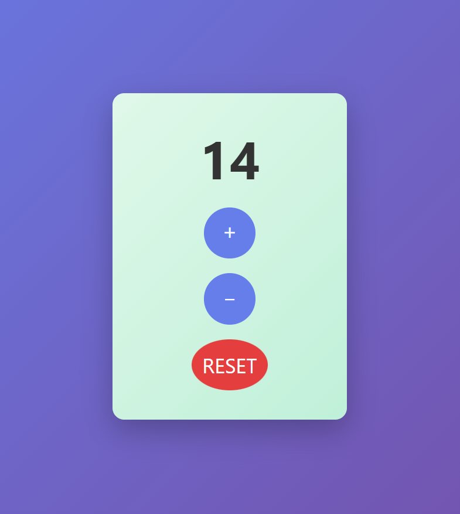

# Counter App 🚀

## 📖 Descrizione
Questa è una semplice **Counter App interattiva** sviluppata con **HTML, CSS e JavaScript**.  
Permette di incrementare, decrementare e resettare un contatore con animazioni, colori dinamici e un suono pop ad ogni click.  
Il valore del contatore viene salvato automaticamente nel **localStorage**, così da mantenerlo anche dopo il refresh della pagina.

## 🛠 Tecnologie

- Audio: pop sound (pop.mp3)  
- LocalStorage per persistenza del contatore

## 🎯 Funzionalità principali
- **Incrementa e decrementa** il contatore con pulsanti dedicati  
- **Reset** per riportare il contatore a 0  
- **Colori dinamici**:
  - Verde per valori positivi
  - Rosso per valori negativi
  - Grigio per 0
- **Animazioni** sul numero (scala e glow) ad ogni click  
- **Cambio di background** a seconda del valore del contatore  
- **Salvataggio automatico** del valore nel localStorage  

## ⚡ Come usare / installare
1. Apri il progetto in un editor (es. VS Code)  
2. Assicurati di avere il file audio `pop.mp3` nella stessa cartella  
3. Apri `index.html` nel browser per vedere l'app funzionare  

💡 **Tip:** Puoi ricaricare la pagina e il contatore manterrà il valore precedente grazie al LocalStorage!

## 🖱 Esempio di utilizzo

### ➕ Incremento
Cliccando sul pulsante `＋` il contatore aumenta di 1, cambia colore e suona il pop  

### ➖ Decremento
Cliccando sul pulsante `−` il contatore diminuisce di 1, cambia colore e suona il pop  

### 🔄 Reset
Cliccando su `RESET` il contatore torna a 0 con animazione e cambio di colore  

## 🖼 Screenshot
*(aggiungi immagini o GIF del contatore in azione qui, opzionale ma consigliato)*

## 📬 Contatti
- 🦁🌞 **Nome:** Luciano Pacini  
- **GitHub:** https://github.com/lucianopacini  
- **EMAIL:** lucianopacini.agent@gmail.com

## 🙏 Crediti
Grazie a Start2Impact per la formazione e l’ispirazione nello sviluppo del progetto
